# Origins

```mermaid
graph TB
    %% ============================================
    %% FOUNDATIONAL LAYER (1930s-1960s)
    %% ============================================
    LambdaCalculus[Lambda Calculus<br/>Alonzo Church<br/>1930s]

    %% ============================================
    %% LISP DYNASTY (1958-1984)
    %% ============================================
    Lisp[Lisp<br/>John McCarthy<br/>1958]
    Lisp15[Lisp 1.5<br/>1962]
    Maclisp[Maclisp<br/>MIT Project MAC<br/>~1966]

    %% ============================================
    %% CONCURRENT/LOGIC PROGRAMMING (1970s-1980s)
    %% ============================================
    Prolog[Prolog<br/>Alain Colmerauer<br/>1972]
    Smalltalk[Smalltalk<br/>Alan Kay et al.<br/>1972]
    Scheme[Scheme<br/>Sussman & Steele<br/>1975]
    CSP[CSP<br/>Tony Hoare<br/>1978]
    PLEX[PLEX<br/>Ericsson<br/>~1974]

    %% ============================================
    %% 1980s SYNTHESIS LANGUAGES
    %% ============================================
    ZetaLisp[ZetaLisp<br/>Symbolics<br/>~1980]
    CommonLisp[Common Lisp<br/>1984]
    Parlog[Parlog<br/>1986]

    %% ============================================
    %% ERLANG EMERGENCE (1986-1998)
    %% ============================================
    Erlang[Erlang<br/>Armstrong, Virding, Williams<br/>1986-1998]

    %% ============================================
    %% FUNCTIONAL PROGRAMMING EVOLUTION (1990s)
    %% ============================================
    Haskell[Haskell<br/>1990]
    BEAM[BEAM VM<br/>1993]
    Java[Java/JVM<br/>1995]

    %% ============================================
    %% 2000s DATA STRUCTURES & THEORY
    %% ============================================
    Bagwell[Hash Array Mapped Tries<br/>Phil Bagwell<br/>2001]
    CoreErlang[Core Erlang<br/>2001]

    %% ============================================
    %% 2000s MODERN SYNTHESIS (2007-2008)
    %% ============================================
    Clojure[Clojure<br/>Rich Hickey<br/>2007]
    LFE[LFE<br/>Robert Virding<br/>2007-2008]

    %% ============================================
    %% GO LINEAGE (for context)
    %% ============================================
    Algol60[Algol 60<br/>1960]
    Pascal[Pascal<br/>1970]
    C[C<br/>1972]
    Modula2[Modula-2<br/>1978]
    Oberon[Oberon<br/>1987]
    Squeak[Squeak<br/>1985]
    Newsqueak[Newsqueak<br/>1989]
    Oberon2[Oberon-2<br/>1991]
    Alef[Alef<br/>1993]
    Go[Go<br/>2009]

    %% ============================================
    %% ZYLISP - THE GRAND SYNTHESIS (2025)
    %% ============================================
    Zylisp[Zylisp<br/>2025]

    %% ============================================
    %% FOUNDATIONAL CONNECTIONS
    %% ============================================
    LambdaCalculus --> Lisp
    LambdaCalculus --> Scheme

    %% ============================================
    %% LISP DYNASTY EVOLUTION
    %% ============================================
    Lisp --> Lisp15
    Lisp15 --> Maclisp
    Maclisp --> ZetaLisp
    Lisp --> CommonLisp
    Lisp --> Scheme

    %% ============================================
    %% SMALLTALK'S WIDESPREAD INFLUENCE
    %% ============================================
    Smalltalk -.OOP, message passing.-> ZetaLisp
    Smalltalk -.message passing.-> Erlang

    %% ============================================
    %% ERLANG LINEAGE
    %% ============================================
    Prolog --> Erlang
    PLEX --> Erlang
    CSP -.theory, ! operator.-> Erlang
    Parlog -.concurrent logic.-> Erlang
    Erlang --> BEAM
    BEAM --> CoreErlang

    %% ============================================
    %% LFE SYNTHESIS
    %% ============================================
    Maclisp --> LFE
    CommonLisp -.Lisp-2, macros.-> LFE
    Scheme -.lexical scope.-> LFE
    Erlang --> LFE
    CoreErlang --> LFE

    %% ============================================
    %% CLOJURE SYNTHESIS
    %% ============================================
    CommonLisp --> Clojure
    Scheme --> Clojure
    Haskell -.STM, immutability, lazy seqs.-> Clojure
    Bagwell -.persistent structures.-> Clojure
    Java --> Clojure
    Erlang -.agents.-> Clojure

    %% ============================================
    %% GO LINEAGE
    %% ============================================
    Algol60 --> Pascal
    Pascal --> Modula2
    Modula2 --> Oberon
    Oberon --> Oberon2
    C --> Go
    CSP --> Squeak
    Squeak --> Newsqueak
    Newsqueak --> Alef
    Alef --> Go
    Modula2 -.packages.-> Go
    Oberon2 -.syntax.-> Go
    Scheme -.lexical scope.-> Go

    %% ============================================
    %% THE GRAND CONVERGENCE TO ZYLISP
    %% ============================================
    Go --> Zylisp
    Clojure --> Zylisp
    Erlang --> Zylisp
    LFE --> Zylisp
    ZetaLisp --> Zylisp

    %% ============================================
    %% KEY TRANSITIVE INFLUENCES TO ZYLISP
    %% ============================================
    Lisp -.S-expressions, homoiconicity.-> Zylisp
    BEAM -.concurrency runtime.-> Zylisp
    Haskell -.functional paradigms.-> Zylisp
    CommonLisp -.macro system.-> Zylisp

    %% ============================================
    %% STYLING BY ERA AND PARADIGM
    %% ============================================
    classDef foundationStyle fill:#E8EAF6,stroke:#5C6BC0,color:#000,stroke-width:3px
    classDef lisp50sStyle fill:#C8E6C9,stroke:#388E3C,color:#000
    classDef lisp60sStyle fill:#A5D6A7,stroke:#388E3C,color:#000
    classDef concurrent70sStyle fill:#FFE082,stroke:#F9A825,color:#000
    classDef lisp80sStyle fill:#81C784,stroke:#2E7D32,color:#000
    classDef erlangStyle fill:#EF5350,stroke:#C62828,color:#fff,stroke-width:3px
    classDef fp90sStyle fill:#FFB74D,stroke:#F57C00,color:#000
    classDef vmStyle fill:#90CAF9,stroke:#1976D2,color:#000
    classDef modern2000sStyle fill:#BA68C8,stroke:#7B1FA2,color:#fff,stroke-width:3px
    classDef goLineageStyle fill:#00ADD8,stroke:#00728C,color:#fff
    classDef zylispStyle fill:#7C4DFF,stroke:#512DA8,color:#fff,stroke-width:4px

    class LambdaCalculus foundationStyle
    class Lisp lisp50sStyle
    class Lisp15,Maclisp,Algol60 lisp60sStyle
    class Prolog,Smalltalk,Scheme,CSP,PLEX,Pascal,C concurrent70sStyle
    class ZetaLisp,CommonLisp,Parlog,Modula2 lisp80sStyle
    class Erlang erlangStyle
    class Haskell,BEAM,Java,Squeak,Newsqueak,Oberon,Alef fp90sStyle
    class Bagwell,CoreErlang,Oberon2 vmStyle
    class Clojure,LFE,Go modern2000sStyle
    class Zylisp zylispStyle
```

Five programming languages ultimately led to the creation of Zylisp:

* ZetaLisp
* Erlang
* Clojure
* LFE
* Go

Or, in order of most influence:

* LFE
* Go
* Erlang
* ZetaLisp
* Clojure

The ordering of the above is very particular: in implemeting LFE, Robert Virding essentially created a near-textbook for future language designers, especially those who wish to implement dialects of another language on that base language's VM. Zylisp has to make many of the same desicions that LFE did, and where foundational language restrictions didn't apply, Zylisp makes nearly all the same choices that Robert did. This is not blind trust nor over enthusiastic devotion: it's merely following excellent advice and good decisn decisions.

While Zylisp is built on top of Go and _completely_ depends upon the almost unbelievably good AST the Go team created -- even with all of that, LFE has made a bigger impact on Zylisp. The impact of Erlang's OTP on Zylisp's design is also quite significant, and might have exceeded the influence of Go itself, if Go's AST had been any less remarkable.

ZetaLisp had an impact on both LFE and Zylisp, and the ZetaLisp documentation remained a touchstone throughout the development of Zylisp. Clojure's impact has come from not only its incredible selection of beautifully hand-crafted language macros, but via its extraordinary standard library: Clojure may have one of the most internally consistent language libraries ever created.

These core influences represent unique, if not entirely distinct evolutionary branches in programming language history, each drawing from overlapping but different ancestral lines. Go (2009) emerged from Google and Bell Labs heritage, consolidating systems programming efficiency with CSP-based concurrency to address software engineering at massive scale. ZetaLisp (~1980) descended from MIT's AI Lab as the pinnacle of the original Lisp tradition, optimized for dedicated hardware and enriched with Smalltalk-inspired object orientation. Erlang (1986-1998) was forged at Ericsson to solve telecommunications challenges through revolutionary concurrency primitives and fault-tolerance mechanisms born from PLEX and Prolog. Clojure (2007) brought Lisp philosophy into the modern era with immutability-first design, persistent data structures, and pragmatic JVM integration. LFE (2007-2008) represents a unique convergence, uniting Lisp's metaprogramming power with Erlang's battle-tested concurrency model through Robert Virding's dual expertise as both Erlang co-creator and Lisp implementer.

Together, these five languages trace back through seven decades of programming language innovation, from McCarthy's original Lisp (1958), through Thompson and Ritchie's Unix and C (1969-1972), Hoare's CSP theory (1978), Wirth's structured programming lineage (1960-1991), and contemporary functional programming paradigms. They draw from at least 30 distinct programming languages across multiple traditions—systems programming (C, Plan 9), concurrent programming (CSP, Newsqueak, Alef, Limbo), symbolic computation (Lisp, Maclisp, Scheme), logic programming (Prolog), object orientation (Smalltalk), functional programming (Haskell, ML), and modern platform integration (JVM, BEAM). This creates a rich tapestry of influences spanning telecommunications fault-tolerance, distributed systems concurrency, metaprogramming flexibility, immutable data structures, type safety, and software engineering pragmatism—all flowing into Zylisp's 2025 release as a grand synthesis of programming language design wisdom accumulated across computing's entire history.
