# Clojure's modern synthesis: Functional programming meets the JVMs

```mermaid
graph TB
    %% Foundational theory
    LambdaCalculus[Lambda Calculus<br/>Alonzo Church<br/>1930s]

    %% Lisp lineage
    Lisp[Lisp<br/>John McCarthy<br/>1958]
    CommonLisp[Common Lisp<br/>1984]
    Scheme[Scheme<br/>Sussman & Steele<br/>1975]

    %% Functional programming
    ML[ML Family<br/>Early 1970s]
    Haskell[Haskell<br/>1990]

    %% Data structures theory
    Bagwell[Hash Array Mapped Tries<br/>Phil Bagwell<br/>2001]

    %% Database theory
    MVCC[MVCC<br/>Database Theory<br/>Pre-2000s]

    %% Platform languages
    Java[Java/JVM<br/>1995]
    CSharp[C# / .NET CLR<br/>2000]

    %% Other influences
    Erlang[Erlang<br/>1986-1998]
    RDF[RDF<br/>W3C Standard]

    %% Clojure
    Clojure[Clojure<br/>Rich Hickey<br/>2007]

    %% Foundational connections
    LambdaCalculus --> Lisp
    LambdaCalculus --> ML
    LambdaCalculus --> Scheme

    %% Lisp family evolution
    Lisp --> CommonLisp
    Lisp --> Scheme

    %% ML to Haskell
    ML --> Haskell

    %% Primary influences to Clojure
    CommonLisp --> Clojure
    Scheme --> Clojure
    Haskell --> Clojure
    Java --> Clojure

    %% Data structures
    Bagwell -.persistent data structures.-> Clojure

    %% Concurrency
    Haskell -.STM, lazy sequences.-> Clojure
    MVCC -.transaction model.-> Clojure
    Erlang -.agents, reactive model.-> Clojure

    %% Platform
    Java -.JVM host, interop.-> Clojure
    CSharp -.CLR experiments, dotLisp.-> Clojure

    %% Other influences
    ML -.pattern matching concepts.-> Clojure
    RDF -.information model.-> Clojure

    %% Key contributions
    Lisp -.homoiconicity, macros, REPL.-> Clojure
    CommonLisp -.macro system, rich stdlib.-> Clojure
    Scheme -.lexical scope, closures, minimalism.-> Clojure
    Haskell -.take/drop/iterate, immutability.-> Clojure
    Bagwell -.32-way branching HAMTs.-> Clojure

    %% Styling
    classDef foundationStyle fill:#E8EAF6,stroke:#5C6BC0,color:#000
    classDef lispStyle fill:#81C784,stroke:#388E3C,color:#000
    classDef fpStyle fill:#FFE082,stroke:#F9A825,color:#000
    classDef dataStyle fill:#B39DDB,stroke:#673AB7,color:#000
    classDef platformStyle fill:#90CAF9,stroke:#1976D2,color:#000
    classDef otherStyle fill:#BCAAA4,stroke:#6D4C41,color:#000
    classDef clojureStyle fill:#63B132,stroke:#3E7B1F,color:#fff

    class LambdaCalculus foundationStyle
    class Lisp,CommonLisp,Scheme lispStyle
    class ML,Haskell fpStyle
    class Bagwell,MVCC dataStyle
    class Java,CSharp platformStyle
    class Erlang,RDF otherStyle
    class Clojure clojureStyle
```

**Clojure (October 2007)**, created by Rich Hickey after approximately 2.5 years of self-funded sabbatical development starting in 2005, represents a deliberate synthesis of multiple language traditions adapted for modern concurrent programming. The name itself signals its influences: a wordplay on "closure" incorporating C, L, and J for **C#, Lisp, and Java**—three languages that profoundly shaped its design.

The **Lisp family** provides Clojure's foundational DNA. From **Original Lisp (1958)**, Clojure inherits code-as-data homoiconicity, S-expression syntax, the macro system, REPL interactive development, first-class functions, dynamic typing, and lambda calculus foundations. **Common Lisp (1984)** contributed the macro system design with modifications (Clojure adds namespace qualification to syntax-quote preventing unintended name capture), backquote/unquote concepts, generic functions influencing protocols, multiple dispatch ideas, and the philosophy of a rich standard library. **Scheme (1975)**, developed by Gerald Jay Sussman and Guy L. Steele at MIT, provided lexical scoping, first-class closures, tail call optimization philosophy (implemented differently on the JVM), and minimalist design principles.

**Haskell (1990)** exerted enormous influence on Clojure's functional programming approach. Rich Hickey stated: "I think Haskell is a fantastic, awe-inspiring piece of work... it certainly was a positive influence." From Haskell came function names and operations like **take, drop, iterate, and repeat**, the lazy sequences model enabling infinite data structures, emphasis on immutability as default, Software Transactional Memory (STM) pioneered by Tim Harris, Simon Marlow, Simon Peyton Jones, and Maurice Herlihy in a 2005 paper, type class concepts influencing Clojure's protocols facility, and patterns for higher-order functions (map, reduce, filter). However, Clojure's STM implementation differs: while Haskell uses elegant STM, Clojure employs **Multiversion Concurrency Control (MVCC)** borrowed from database theory—used in major databases for decades before Clojure and providing snapshot isolation for transactions.

**Phil Bagwell's work (2000-2001)** on Hash Array Mapped Tries (HAMTs) from his "Ideal Hash Trees" paper (2001) revolutionized Clojure's data structures. Clojure's PersistentHashMap builds on Bagwell's HAMT with path copying for persistence, **32-way branching trees** achieving O(log32 N) time complexity (~6 hops to leaf maximum), and structural sharing for memory efficiency. Clojure extended HAMTs to vectors and influenced later adoption by Scala (2010), Haskell (2011), and Erlang (2015). All core data structures—lists, vectors, maps, and sets—are immutable by default with efficient "modification" through structural sharing.

**Java/JVM (1995)** serves as Clojure's host platform through deliberate design philosophy. Hickey proclaimed "VMs, not OSes, are the platforms of the future," embracing the JVM rather than attempting language-as-platform approaches. Clojure compiles to JVM bytecode, provides full Java interoperability through dot-target-member notation, accesses the entire Java ecosystem and libraries, dynamically implements Java interfaces and classes, and shares the JVM's type system, garbage collection, and threading model. **C# and .NET CLR (2000)** influenced parallel development on CLR (later discontinued) and Hickey's earlier dotLisp project experiments.

The **ML family (early 1970s)** contributed pattern matching concepts, algebraic data type ideas (implemented differently in Clojure), and functional programming paradigm principles. **Erlang's** actor model and reactive agent system influenced Clojure's agent design for asynchronous updates. **RDF (Resource Description Framework)**, a W3C standard, influenced Clojure's information model where properties/attributes are inherent in themselves rather than aggregate types, enabling ad hoc aggregation and conflict-free naming—concepts that later influenced Hickey's Datomic database design.

Clojure's design addressed critical problems: the concurrency crisis of mutable shared state, complexity of object-oriented programming with mutable objects creating "balls of mud," need for platform integration leveraging existing Java ecosystems, explicit principled state management, and combining theoretical elegance with practical commercial software development. Rich Hickey's philosophy emphasized simplicity over ease, immutability by default with controlled side effects, data orientation using simple associative structures, platform symbiosis rather than recreating host environments, and pragmatic balance between functional purity and real-world utility.
