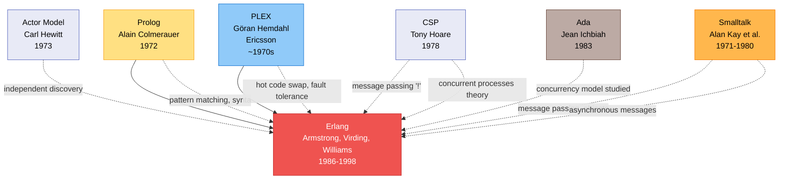

# Erlang's telecommunications heritage: From PLEX to Distributed Systems

**Prolog (1972)**, developed by Alain Colmerauer at the University of Aix-Marseille, France, served as Erlang's immediate ancestor and implementation language. The first Erlang (1986) was implemented as a meta-interpreter in Prolog, and Joe Armstrong's breakthrough came when Roger Skagervall showed him that his telephony notation was essentially a Prolog program. Armstrong added concurrency primitives to Prolog, creating the first Erlang. The language inherited Prolog's pattern matching syntax, atoms and variables, scoping rules, dynamic type system without static checking, and predicate-based language structure. Erlang initially used Prolog infix operators directly, though this later evolved into distinct syntax.

**PLEX (Programming Language for EXchanges)**, developed in the 1970s by Göran Hemdahl at Ericsson for the AXE telephone switching system (first produced in 1974), profoundly shaped Erlang's architecture. Armstrong explicitly stated: "Erlang was heavily influenced by PLEX and the AXE design." From PLEX came **hot code swapping**—the ability to change code without stopping the system, critical for telephone exchanges that must never go down. PLEX's process isolation with no shared memory, error handling philosophy where processes should fail and restart rather than share corrupted state, signal-based message passing, and treatment of hardware as processes all became core Erlang principles. The goal was creating "something like PLEX, to run on ordinary hardware, only better."

**CSP (Communicating Sequential Processes, 1978)**, created by Tony Hoare with a full book published in 1985, contributed theoretical foundations and the iconic **! operator** for sending messages—taken directly from CSP notation. While CSP described synchronous communication through rendezvous, Erlang diverged by implementing asynchronous message passing, but the formal language for describing concurrent system interactions provided crucial theoretical grounding.

**Smalltalk (1972)** influenced Erlang through Joe Armstrong's early experimentation. Armstrong wrote: "I made a model with phone objects and an exchange object. If I sent a ring message to a phone it was supposed to ring." This message-passing paradigm, object-oriented thinking where everything is an entity communicating through messages, and dynamic interactive development environment shaped Armstrong's conception of telephony systems. Notably, Smalltalk appears as an influence on both ZetaLisp and Erlang, demonstrating Alan Kay's widespread impact on 1970s-1980s language design.

Additional influences include **Ada (1983)**, developed by Jean Ichbiah's team for the US Department of Defense, which was examined during the 1985 SPOTS (SPC for POTS) project where Armstrong's team programmed basic telephony in multiple languages. Ada's task model for concurrency and real-time systems design principles were studied, though Erlang ultimately chose different approaches. **Concurrent Euclid**, **CHILL** (telecommunications industry standard), **EriPascal** (Ericsson's concurrent Pascal variant), and **CLU (1974-1977)** by Barbara Liskov at MIT were all evaluated. Notably, **the Actor Model (1973)** by Carl Hewitt was NOT a direct influence—Armstrong and Virding explicitly stated they were unaware of actor theory during Erlang's design, though Erlang processes resemble actors with asynchronous message passing and selective receive.

Erlang's development timeline spans **1986** (initial Prolog implementation), **1989** (JAM - Joe's Abstract Machine, first working version with 70x speedup), **1993** (BEAM - Bogdan's Erlang Abstract Machine, providing 10x additional speedup), and **December 2, 1998** (open source release). Created by Joe Armstrong, Robert Virding, and Mike Williams at Ericsson Computer Science Laboratory, Erlang addressed a critical problem: over 450 programming languages used at Ericsson with none standardized for programming telephone switching systems requiring extreme reliability, massive concurrency (tens to hundreds of thousands of simultaneous calls), soft real-time performance, and hot code swapping for continuous operation.
