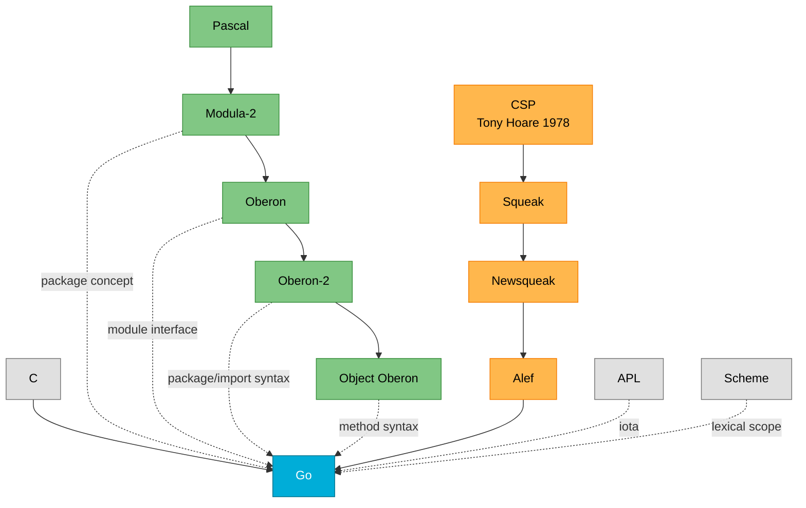

# Go: From Bell Labs to Google

**Go (2009)**, designed by Robert Griesemer, Rob Pike, and Ken Thompson at Google, represents a unique convergence of systems programming heritage, concurrent programming research, and modern software engineering pragmatism. Unlike languages born from academic research or single-paradigm thinking, Go emerged from the practical frustrations of building large-scale software at Google, where millions of lines of code, thousands of engineers, and massive distributed systems demanded something better than the existing C++, Java, and Python ecosystem. The designers—two of whom were architects of Unix and Plan 9—brought decades of experience from Bell Labs' legendary Computing Science Research Center, creating what they described as "language design in the service of software engineering" rather than language research for its own sake.

## The C Dynasty: Systems Programming Foundation

**C (1972)**, created by Dennis Ritchie at Bell Labs for the Unix operating system, provides Go's foundational DNA. From C, Go inherited **expression syntax** (operators, precedence, basic arithmetic), **control-flow statements** (if, for, switch with C-like structure), **basic data types** (integers, floats, booleans, though reimagined), **call-by-value parameter passing** ensuring predictable behavior, **pointers** for explicit memory addressing (though without pointer arithmetic), and crucially, **C's emphasis on programs that compile to efficient machine code** and cooperate naturally with operating system abstractions. Ken Thompson, Go's co-designer, created C's immediate predecessor **B (1969)** at Bell Labs, and his deep understanding of systems programming permeates Go's design.

The Go team explicitly acknowledged C's influence while consciously avoiding its complexities. As Ken Thompson stated about Go's origins: "When the three of us got started, it was pure research. The three of us got together and decided that we hated C++." This wasn't rejection of C itself, but of the complexity that accumulated in C++ through features like multiple inheritance, operator overloading, and template metaprogramming. Go takes C's directness and efficiency while adding modern conveniences like garbage collection and memory safety.

**Plan 9 from Bell Labs (mid-1980s-2015)**, the operating system that "replaced Unix as Bell Labs's primary platform for operating systems research," profoundly shaped Go's philosophy. Developed by Rob Pike, Ken Thompson, Dave Presotto, Phil Winterbottom, and Dennis Ritchie at the Computing Science Research Center, Plan 9 applied Unix principles more broadly and aggressively. The operating system's design mantra—**"everything is a file"** extended via a pervasive network-centric distributed filesystem—influenced Go's compositional thinking. Plan 9 introduced **UTF-8 encoding** (invented by Ken Thompson and Rob Pike in 1992), which became Go's native string encoding from day one, eliminating the character encoding nightmares that plagued other languages.

Plan 9's **rfork** system call, offering fine-grained control over process resource sharing (memory, file descriptors, namespace), presaged Go's lightweight goroutines. The operating system's philosophy of **simplicity through uniformity**—one consistent interface applied everywhere—echoes in Go's design where interfaces provide uniform abstraction without inheritance complexity. Rob Pike's work on Plan 9's concurrent window system **8½** demonstrated CSP-based GUI programming, proving the model's practical viability beyond theoretical interest.

## The Wirthian Heritage: Structure and Discipline

**Algol 60 (1960)** established the foundation for structured programming that flows through Go via the Pascal/Modula/Oberon lineage. Though Go's designers never directly cite Algol, its influence permeates through **block structure with explicit scope**, **structured control flow** without goto spaghetti, and **formal syntax** enabling predictable parsing.

**Pascal (1970)**, created by Niklaus Wirth, influenced Go through its emphasis on **clarity and teachability**. From Pascal's tradition came Go's preference for **explicit declarations** over implicit conversions, **strong typing** without type hierarchy complexity, and **readable syntax** prioritizing human comprehension. While Go uses C-like syntax, Pascal's philosophy of "programs should be written for people to read, and only incidentally for machines to execute" resonates throughout Go's design.

**Modula-2 (1978)**, Wirth's successor to Pascal, contributed the crucial concept of **modules for separate compilation** and **explicit interfaces between compilation units**. Go's package system—with its distinction between package-level exports (capitalized names) and private implementation details—directly descends from Modula-2's module concept. The language introduced **clean separation between interface and implementation**, avoiding the header-file problems that plague C/C++.

**Oberon (1987)** and **Oberon-2 (1991)** refined the module concept further. From these languages, Go inherited the **syntax for imports and package declarations**, the elimination of unnecessary distinctions between module interface files and implementation files (Oberon's innovation), and **methods associated with types** without class hierarchy baggage. Oberon's minimalist philosophy—removing features rather than adding them—strongly influenced Go's design principle of saying "no" to features that don't pay for their complexity.

## The CSP Lineage: Concurrency as Core Design

**Communicating Sequential Processes (CSP, 1978)**, Tony Hoare's seminal paper and 1985 book, provided the theoretical foundation for Go's concurrency model. CSP described **parallel composition of processes with no shared state**, **synchronous communication through channels** for coordination, and **formal language for reasoning about concurrent systems**. The paper introduced the **`!` operator for sending** and **`?` operator for receiving** messages—Go adopted `<-` for both operations in a more symmetric notation.

However, Go diverged from pure CSP in critical ways. While Hoare's CSP used synchronous rendezvous (both sender and receiver must be ready), Go implements **asynchronous message passing through buffered channels**, allowing senders to proceed without waiting for receivers when buffer space exists. This pragmatic choice enabled higher performance in real systems while maintaining CSP's conceptual clarity.

**Squeak (1985)**, developed by Luca Cardelli and Rob Pike at Bell Labs, marked the first implementation of CSP ideas in a practical language. Titled "a language for communicating with mice," Squeak addressed GUI programming where multiple input devices (keyboards, mice) generate concurrent event streams. The language demonstrated that **CSP's theoretical model could solve real interface programming problems**, though channels weren't yet first-class values.

**Newsqueak (1989)**, Rob Pike's evolution of Squeak, made channels **first-class objects** that could be stored in variables, passed as function arguments, and sent across channels themselves. This innovation—enabling **programmatic construction of communication structure**—proved revolutionary. Doug McIlroy's famous paper "Squinting at Power Series" demonstrated elegant symbolic mathematics using Newsqueak's channel primitives, showing that CSP-based languages could handle problems traditionally requiring lazy functional programming. Newsqueak's syntax was C-like with **special syntax for concurrent processes (prog)** and the **select statement** for multiplexing channel operations—both of which directly inspired Go's goroutine and select syntax.

**Alef (1993)**, designed by Phil Winterbottom for Plan 9, implemented Newsqueak's channel model in a **compiled, C-like systems programming language**. Alef distinguished between **procs** (preemptively-scheduled OS processes) and **tasks** (cooperatively-scheduled coroutines within procs), prefiguring Go's distinction between OS threads and goroutines. However, Alef lacked garbage collection despite urgings from Rob Pike and others, making concurrent programming painful as managing channel and process lifetimes became error-prone. Rob Pike later explained: "although Alef was a fruitful language, it proved too difficult to maintain a variant language across multiple architectures, so we took what we learned from it and built the thread library for C."

**Limbo (1995)**, created by Sean Dorward, Phil Winterbottom, and Rob Pike for the Inferno operating system, learned from Alef's mistakes by adding **automatic garbage collection**, **module system with explicit interfaces**, and the **Dis virtual machine** for architecture independence. Limbo's approach to concurrency was "inspired by Hoare's communicating sequential processes (CSP), as implemented and amended in Pike's earlier Newsqueak language and Winterbottom's Alef." The language proved that CSP-based concurrency could work in a practical, garbage-collected systems language—a direct precursor to Go.

## Other Influences: The Broader Context

**APL (1966)**, Kenneth Iverson's array-oriented language, contributed the **iota concept** that appears in Go's `iota` constant generator for creating sequences of related constants. While Go doesn't adopt APL's symbolic density, the idea of generating sequences programmatically rather than manually enumerating values comes from this lineage.

**Scheme (1975)**, developed by Gerald Jay Sussman and Guy L. Steele Jr. at MIT, influenced Go through **lexical scoping with nested functions** and the general principle of **minimalism over feature accumulation**. While Go isn't a functional language, Scheme's philosophy of achieving power through composition of simple primitives rather than complex special-purpose features resonates in Go's design.

The Go FAQ explicitly states: "Go is mostly in the C family (basic syntax), with significant input from the Pascal/Modula/Oberon family (declarations, packages), plus some ideas from languages inspired by Tony Hoare's CSP, such as Newsqueak and Limbo (concurrency)." This succinctly captures Go's three major lineages converging.

## Go's Creation: From Frustration to Philosophy

Go's design began on **September 21, 2007**, when Robert Griesemer, Rob Pike, and Ken Thompson started sketching goals on a whiteboard at Google. The immediate catalyst was frustration with C++ compilation times—waiting 45 minutes for large builds to complete—but the deeper problem was **software complexity at Google's scale**. With millions of lines of code across hundreds of languages, thousands of engineers working at the "head" of a single source tree, and constant churn across all system levels, existing languages couldn't keep pace.

By January 2008, Ken Thompson started work on a compiler generating C code as output. Ian Lance Taylor independently began a GCC frontend in May 2008. Russ Cox joined in late 2008, helping move language and libraries from prototype to reality. The language became a public open-source project on **November 10, 2009**, and version 1.0 shipped on **March 28, 2012**, with a groundbreaking promise: **Go 1.0 programs would remain compatible with future Go versions**, a guarantee that proved transformative for enterprise adoption.

The design goals were explicit and practical:

- **Compilation speed**: Large executables must build in seconds on a single computer
- **Dependency management**: Rigorous, automatic tracking to prevent cascading rebuilds
- **Simplicity**: Language spec small enough to hold in a programmer's head
- **Orthogonality**: Features that compose cleanly without special cases
- **Concurrency support**: Built-in primitives for multicore and networked systems
- **Garbage collection**: Automatic memory management with low latency
- **Fast execution**: Performance comparable to C/C++
- **Type safety**: Catch errors at compile time, not production runtime
- **Memory safety**: Prevent buffer overflows, use-after-free, null pointer panics where possible
- **No implicit conversions**: Explicit over implicit for maintainability
- **No inheritance**: Composition over hierarchy for flexibility

As Rob Pike explained: "Go is about language design in the service of software engineering." The team applied what Pike called a **consensus veto**: all three designers had to agree before adding any feature, ensuring nothing extraneous entered the language. This discipline produced Go's distinctive minimalism—no generics until 2022 (15 years after design began), no exceptions (use explicit error returns), no operator overloading, no default parameters, no inheritance, no macros.

## Go's Innovations and Impact

While Go carefully inherited from predecessors, it introduced significant innovations:

**Goroutines and channels**: Lightweight processes (starting at ~2KB stack) with dynamic growth, multiplexed onto OS threads by the runtime scheduler. Channels provide typed, synchronized communication. This makes concurrent programming accessible—spawning a million goroutines is practical.

**Interfaces without explicit implementation**: Types satisfy interfaces automatically if they have the required methods. This **structural typing** eliminates fragile coupling between packages and enables composition without planning.

**The `defer` statement**: Ensures cleanup code runs even on panic, simplifying resource management. Novel to Go, it addressed real pain points from C's manual cleanup.

**Multiple return values with explicit error handling**: Instead of exceptions, functions return `(result, error)` pairs. Errors become explicit in function signatures and visible in call sites, making error paths as important as success paths.

**`gofmt` code formatter**: Enforces uniform style mechanically, eliminating style debates. Rob Pike: "Gofmt's style is no one's favorite, yet gofmt is everyone's favorite." This influenced formatters for Rust, Java, C++ (clang-format), and others.

**Fast compilation**: Through careful dependency design and parallel compilation, Go achieves build speeds unmatched by comparable languages. Million-line codebases compile in seconds.

**Static linking by default**: Produces single binary with no external dependencies, simplifying deployment. Influenced by Bell Labs' skepticism of dynamic linking, this made Go dominant for CLI tools and containers.

## The Bell Labs Through-Line

Go represents the culmination of **over 40 years of research at Bell Labs' Computing Science Research Center**. Ken Thompson designed Unix (1969), B (1969), C's foundation, and UTF-8 (1992). Rob Pike co-created Unix utilities, Plan 9, UTF-8, and multiple CSP-based languages (Squeak, Newsqueak, Limbo). This deep institutional knowledge—knowing what worked across decades of real systems—enabled Go's creators to "cherry pick" the best ideas while avoiding historical mistakes.

As one observer noted: "I would claim that there has never been a set of language designers with broader or deeper language design expertise than these three. They had a rich knowledge of what came before and they knew just what to cherry pick. They also had the advantage of hindsight."

The Bell Labs philosophy permeates Go: **simplicity over complexity**, **tools over features**, **composition over inheritance**, **explicit over implicit**, **mechanism over policy**. These aren't new ideas—they're Unix philosophy applied to language design, refined through 40 years of building the software infrastructure that powered global telecommunications and computing.

## Conclusion: Evolution, Not Revolution

Go succeeded because it **consolidated rather than invented**. The FAQ states: "Most ideas come from previous ideas"—a principle the designers followed rigorously. From C came systems programming efficiency, from Pascal/Modula/Oberon came structured modularity, from CSP came concurrent programming primitives, from Plan 9 came UTF-8 and distributed systems thinking. Go didn't create these ideas; it combined them in a pragmatic package optimized for modern software engineering at scale.

The result is a language that feels simultaneously old and new—C-like syntax with CSP concurrency, Pascal-like declarations with garbage collection, systems programming performance with memory safety. Go's success (powering Docker, Kubernetes, Ethereum, Terraform, and countless production systems) validates the designers' philosophy: when building infrastructure languages for the next 40 years, evolution trumps revolution, and consolidation beats innovation.

As Rob Pike reflected on Go's 14th anniversary: "Go's success is attributed to its focus on concurrency and parallelism, tailored for handling large workloads on multi-core processors... and its developer-centric philosophy" combined with "a thriving community." The language achieved what its creators intended: **eliminating the slowness and clumsiness of software development at Google scale**, making the process **more productive and scalable** for the engineers who write, read, debug, and maintain large software systems.

From Bell Labs in 1969 to Google in 2009—spanning Unix, Plan 9, four CSP languages, and the experience of maintaining operating systems used by billions—Go represents not just a new language but the distilled wisdom of computing's founding generation, packaged for the modern era.
