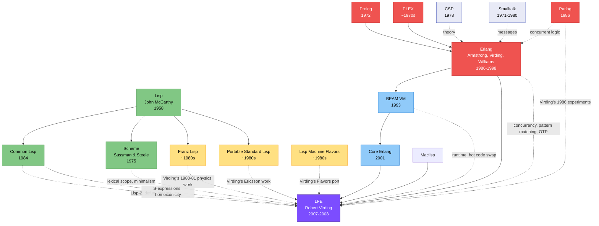

# LFE: The convergence of Lisp and Erlang traditions

**LFE (Lisp Flavoured Erlang)**, initially developed in 2007 with first public release in March 2008 and stable version 1.0 in 2016, represents a unique synthesis in programming language history. Created by **Robert Virding**—one of Erlang's three co-inventors alongside Joe Armstrong and Mike Williams—LFE brings together two distinct lineages in a way no other language has attempted.

LFE inherits from the entire **Lisp family**: **Original Lisp (1958)** provides S-expressions, prefix notation, homoiconicity, first-class functions, recursion, garbage collection, and REPL interactive development. **Common Lisp (1984)** contributes the Lisp-2 architecture with separate namespaces for functions and variables (functions referenced with #'function-name/arity notation), syntax elements including defun, lambda, let/let*, quote, backquote and unquote for macro templates, and docstrings. **Scheme (1975)** influences the minimalist philosophy, lexical scoping considerations, and clean functional style. Virding stated LFE has "the feel of CL and Scheme, especially CL."

More remarkably, LFE inherits from **Erlang (1986-1998)** and transitively all of Erlang's influences. Core language semantics include pattern matching in function clauses and control structures, guards for refined pattern matching, multiple function clauses, immutable data structures with single assignment, eager evaluation, dynamic typing, and functions distinguished by name AND arity (making LFE a "Lisp-2+"). All standard Erlang data types are used: atoms, lists, tuples, maps, binaries, records, integers, floats, PIDs, and references.

The **concurrency model** is pure Erlang: lightweight processes with share-nothing architecture, asynchronous message passing between isolated processes with separate heaps, the receive construct for selective message handling, process spawning and linking, and minimal overhead supporting millions of concurrent processes (~300 words per process). The **"let it crash" philosophy**, supervision trees, process monitoring, hot code swapping, and fault tolerance mechanisms come directly from Erlang's telecommunications heritage. Full access to **OTP (Open Telecom Platform)** includes gen_server, gen_fsm/gen_statem, supervisor behaviors, and design patterns enabling nine-9's reliability (99.9999999% uptime).

Through Erlang, LFE indirectly inherits from **Prolog (1972)** via pattern matching and guard semantics, **PLEX (1970s)** via hot code swapping and fault tolerance, **CSP (1978)** via message passing operators, and **Smalltalk (1972)** via message-passing paradigms. The **BEAM Virtual Machine (1992-1993)** and **Core Erlang (2001)** intermediate representation provide LFE's runtime environment—LFE compiles through a three-pass compiler (macro expansion, linting, code generation) to produce 100% compatible Core Erlang code.

Virding's personal history shaped LFE's creation. He first encountered Lisp around 1980-81 as a theoretical physics PhD student at Stockholm University, where the physics department used Lisp for symbolic algebraic computations. At Ericsson Computer Science Lab in the 1980s, he ported **Franz Lisp** to VMS and implemented the **Lisp Machine Flavors** object system on **Portable Standard Lisp (PSL)**—work that inspired LFE's name. He also experimented with **Parlog (1986)**, a concurrent logic programming language used with Nabiel Elshiewy in 1986 that influenced Erlang's concurrent features.

Virding created LFE from multiple motivations: a long-standing goal to make a Lisp specifically designed for BEAM, curiosity about what Lisp would look like built on Erlang's foundations and constraints, technical exploration of compiling another language by generating Core Erlang, personal interest as an "old lisper" wanting his own implementation, and simple love of language implementation as a spare-time project. He noted: "The combination of functions and macros—and the homoiconicity which makes working with macros easy—makes Lisp a very powerful tool. This makes Lisp and the concurrency from Erlang a very good combination."

LFE's unique innovations include pattern matching in macros (impossible in traditional Lisps), lambda-match for anonymous functions with pattern matching capabilities, homoiconicity brought to the BEAM VM (first Lisp on BEAM), and scoped variables in macros without gensym (unsafe in distributed, long-lived code). Zero-penalty Erlang function calls, seamless interoperability with thousands of existing Erlang libraries, and the ability to mix LFE and Erlang code in the same project make LFE fully compatible with vanilla Erlang while adding Lisp's "mad-scientist powers."

Virding noted in hindsight he would have named it "EFL" (Erlang Flavoured Lisp) rather than LFE, as it's truly "Erlang with a Lisp flavour"—the Erlang constraints and features heavily shape the Lisp design. LFE cannot support features requiring global data or destructive operations due to BEAM constraints, but this limitation enables the reliability and concurrency that made Erlang successful in telecommunications. As Virding observed, "Clojure feels more like language with concurrency while Erlang feels more like an operating system with a language"—and LFE brings Lisp syntax to that operating system.
