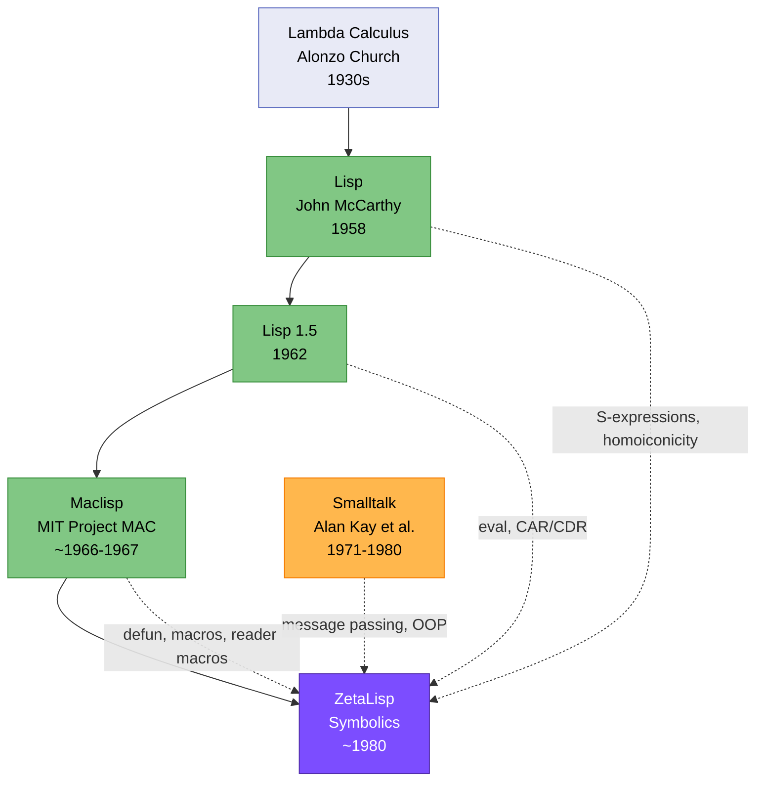

# The Lisp dynasty: From McCarthy to ZetaLisp

**Original Lisp (1958)** stands as the fountainhead for three of our four languages. John McCarthy specified Lisp at MIT in 1958, with Steve Russell implementing the first interpreter in 1959 on the IBM 704. This revolutionary language introduced concepts that would echo through decades: symbolic expressions (S-expressions), prefix notation with fully parenthesized syntax, automatic garbage collection (developed by Daniel Edwards pre-1962), first-class functions, lambda expressions, homoiconicity where code-is-data, the read-eval-print loop (REPL), and dynamic typing. McCarthy drew inspiration from Alonzo Church's lambda calculus, creating a language fundamentally oriented around list processing and recursive functions.

**Lisp 1.5 (1962)** formalized McCarthy's vision through the landmark "LISP 1.5 Programmer's Manual" authored by John McCarthy, Michael I. Levin, Paul W. Abrahams, Daniel J. Edwards, and Timothy P. Hart. This version established the association of functions with property lists, refined the evaluation model around the eval function, and solidified core Lisp primitives including the iconic CAR and CDR operations—names derived from the IBM 704's hardware registers (Contents of Address Register / Contents of Decrement Register). The conditional expression structure (cond) and tree data structures became standard, laying groundwork that would influence computing for generations.

**Maclisp (late 1960s)** emerged from MIT's Project MAC around 1966-1967, primarily developed by Richard Greenblatt for the PDP-6 with ongoing maintenance by Jon L. White. Maclisp revolutionized Lisp performance through dynamic variable binding with value cells—dramatically faster than Lisp 1.5's association lists—and introduced reader macros that improved I/O readability (such as 'A instead of (QUOTE A)). The language featured the Ncomplr compiler generating native machine code for arithmetic operations, arbitrary-precision integers (bignums), arrays and strings, and the now-ubiquitous **defun syntax** for function definitions. Maclisp's compiled versus interpreted code model with inline operations for CAR and CDR set new performance standards.

**ZetaLisp (~1980)** represents Symbolics' commercial variant of Lisp Machine Lisp, originally developed at MIT AI Lab from the mid-to-late 1970s. Key contributors included Richard Greenblatt, David Moon, Richard Stallman, and Daniel Weinreb. The language was explicitly described as a "direct descendant of Maclisp," inheriting all of Maclisp's innovations while adding transformative extensions. ZetaLisp introduced **Flavors**—the first major object-oriented programming system for Lisp, featuring multiple inheritance, message passing, method combination through :before and :after daemons, and mixins. This system drew heavy influence from **Smalltalk (1971-1980)**, developed by Alan Kay, Dan Ingalls, and Adele Goldberg at Xerox PARC. The relationship was bidirectional: "Lisp deeply influenced Alan Kay... and in turn Lisp was influenced by Smalltalk" in object-oriented paradigms, encapsulation, and method dispatch mechanisms.

ZetaLisp's innovations extended beyond Flavors to include proper lexical closures, efficient vectors, stack groups for coroutine-like control structures, locatives for low-level memory access, rational numbers, multiple return values, structures, the generalized assignment mechanism **setf**, and advanced memory management through CDR-coding. The language was "the Lisp dialect with the most influence on the design of Common Lisp" according to multiple sources, with Flavors evolving into CLOS (Common Lisp Object System). ZetaLisp ran on dedicated Lisp Machine hardware with tagged architecture enabling parallel type checking without performance penalties, supporting applications from the Macsyma computer algebra system to sophisticated AI research.
